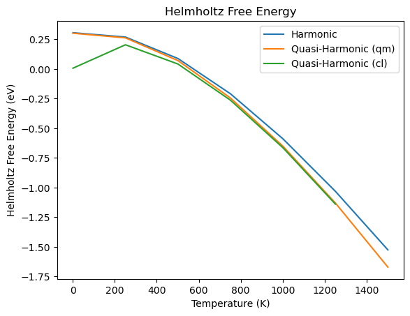
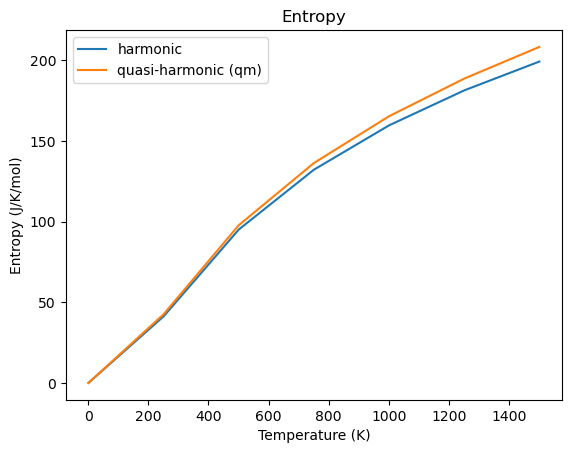
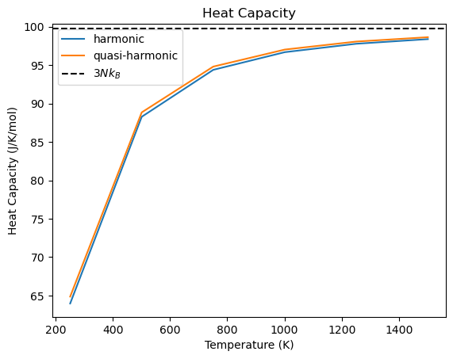
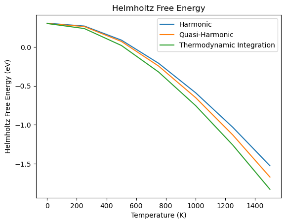

# Materials Properties
Demonstrate the calculation of common material properties with the `atomistics` package. The examples use different 
simulation codes, still the examples are not simulation code specific. It is one of the core features of the `atomistics`
package that all simulation workflow to calculate a specific material property can be executed with all simulation codes.

## Elastic Properties
Calculate the bulk modulus for Aluminium using the [GPAW](https://wiki.fysik.dtu.dk/gpaw/) DFT code:

### Equation of State 
One way to calculate the bulk modulus is using the Equation of State to calculate the equilibrium properties:
```
from ase.build import bulk
from atomistics.calculators import evaluate_with_ase
from atomistics.workflows import EnergyVolumeCurveWorkflow
from gpaw import GPAW, PW

workflow = EnergyVolumeCurveWorkflow(
    structure=bulk("Al", a=4.05, cubic=True),
    num_points=11,
    fit_type='polynomial',
    fit_order=3,
    vol_range=0.05,
    axes=['x', 'y', 'z'],
    strains=None,
)
task_dict = workflow.generate_structures()
print(task_dict)
>>> {'calc_energy': OrderedDict([
>>>     (0.95, Atoms(symbols='Al4', pbc=True, cell=[3.9813426685908118, 3.9813426685908118, 3.9813426685908118])),
>>>     (0.96, Atoms(symbols='Al4', pbc=True, cell=[3.9952635604153612, 3.9952635604153612, 3.9952635604153612])),
>>>     (0.97, Atoms(symbols='Al4', pbc=True, cell=[4.009088111958974, 4.009088111958974, 4.009088111958974])),
>>>     (0.98, Atoms(symbols='Al4', pbc=True, cell=[4.022817972936038, 4.022817972936038, 4.022817972936038])),
>>>     (0.99, Atoms(symbols='Al4', pbc=True, cell=[4.036454748321015, 4.036454748321015, 4.036454748321015])),
>>>     (1.0, Atoms(symbols='Al4', pbc=True, cell=[4.05, 4.05, 4.05])),
>>>     (1.01, Atoms(symbols='Al4', pbc=True, cell=[4.063455248345461, 4.063455248345461, 4.063455248345461])),
>>>     (1.02, Atoms(symbols='Al4', pbc=True, cell=[4.076821973718458, 4.076821973718458, 4.076821973718458])),
>>>     (1.03, Atoms(symbols='Al4', pbc=True, cell=[4.0901016179023415, 4.0901016179023415, 4.0901016179023415])),
>>>     (1.04, Atoms(symbols='Al4', pbc=True, cell=[4.1032955854717175, 4.1032955854717175, 4.1032955854717175])),
>>>     (1.05, Atoms(symbols='Al4', pbc=True, cell=[4.1164052451001565, 4.1164052451001565, 4.1164052451001565]))
>>> ])}
```
In the first step the `EnergyVolumeCurveWorkflow` object is initialized including all the parameters to generate
the strained structures and afterwards fit the resulting energy volume curve. This allows the user to see all relevant
parameters at one place. After the initialization the function `generate_structures()` is called without any
additional parameters. This function returns the task dictionary `task_dict` which includes the tasks which should
be executed by the calculator. In this case the task is to calculate the energy `calc_energy` of the eleven generated 
structures. Each structure is labeled by the ratio of compression or elongation. In the second step the `task_dict` 
is evaluated with the [GPAW](https://wiki.fysik.dtu.dk/gpaw/) simulation code using the `evaluate_with_ase()` function:
```
result_dict = evaluate_with_ase(
    task_dict=task_dict,
    ase_calculator=GPAW(
        xc="PBE",
        mode=PW(300),
        kpts=(3, 3, 3)
    )
)
print(result_dict)
>>> {'energy': {
>>>     0.95: -14.895378072824752,
>>>     0.96: -14.910819737657118,
>>>     0.97: -14.922307241122466,
>>>     0.98: -14.930392279321056,
>>>     0.99: -14.935048569964911,
>>>     1.0: -14.936666396364169,
>>>     1.01: -14.935212782128556,
>>>     1.02: -14.931045138839849,
>>>     1.03: -14.924165445706581,
>>>     1.04: -14.914703574005678,
>>>     1.05: -14.902774559134226
>>> }}
```
In analogy to the `task_dict` which defines the tasks to be executed by the simulation code the `result_dict` summarizes 
the results of the calculations. In this case the energies calculated for the specific strains. By ordering both the 
`task_dict` and the `result_dict` with the same labels, the `EnergyVolumeCurveWorkflow` object is able to match the 
calculation results to the corresponding structure. Finally, in the third step the `analyse_structures()` function takes
the `result_dict` as an input and fits the Equation of State with the fitting parameters defined in the first step:
```
fit_dict = workflow.analyse_structures(output_dict=result_dict)
print(fit_dict)
>>> {'poly_fit': array([-9.30297838e-05,  2.19434659e-02, -1.68388816e+00,  2.73605421e+01]),
>>>  'fit_type': 'polynomial',
>>>  'fit_order': 3,
>>>  'volume_eq': 66.44252286131888,
>>>  'energy_eq': -14.93670322204575,
>>>  'bulkmodul_eq': 72.38919826304497,
>>>  'b_prime_eq': 4.45383655040775,
>>>  'least_square_error': 4.432974529908853e-09,
>>>  'volume': [63.10861874999998, 63.77291999999998, ..., 69.75163125000002],
>>>  'energy': [-14.895378072824752, -14.910819737657118, ..., -14.902774559134226]
>>> }
```
The bulk modulus for Aluminium is calculated using the [GPAW](https://wiki.fysik.dtu.dk/gpaw/) simulation code by fitting
the Equation of State with a third order polynomial over a volume range of +/-5% to be 72.3GPa.  

### Elastic Matrix
An alternative approach to calculate the bulk modulus is based on the relation `B = (1/3) (C11 + 2 C12 )`. The bulk
modulus can be calculated based on the sum of the first elastic constant `C11` and twice the second elastic constant `C12`
divided by there. 
```
from ase.build import bulk
from atomistics.calculators import evaluate_with_ase
from atomistics.workflows import ElasticMatrixWorkflow
from gpaw import GPAW, PW

workflow = ElasticMatrixWorkflow(
    structure=bulk("Al", a=4.05, cubic=True),
    num_of_point=5,
    eps_range=0.05,
    sqrt_eta=True,
    fit_order=2
)
task_dict = workflow.generate_structures()
print(task_dict)
>>> {'calc_energy': OrderedDict([
>>>     ('s_e_0', Atoms(symbols='Al4', pbc=True, cell=[4.05, 4.05, 4.05])), 
>>>     ('s_01_e_m0_05000', Atoms(symbols='Al4', pbc=True, cell=[3.8421673571095107, 3.8421673571095107, 3.8421673571095107])), 
>>>     ('s_01_e_m0_02500', Atoms(symbols='Al4', pbc=True, cell=[3.94745170964797, 3.94745170964797, 3.94745170964797])), 
>>>     ('s_01_e_0_02500', Atoms(symbols='Al4', pbc=True, cell=[4.150015060213919, 4.150015060213919, 4.150015060213919])), 
>>>     ('s_01_e_0_05000', Atoms(symbols='Al4', pbc=True, cell=[4.247675835085893, 4.247675835085893, 4.247675835085893])), 
>>>     ('s_08_e_m0_05000', Atoms(symbols='Al4', pbc=True, cell=[3.8421673571095107, 3.8421673571095107, 4.05])), 
>>>     ('s_08_e_m0_02500', Atoms(symbols='Al4', pbc=True, cell=[3.94745170964797, 3.94745170964797, 4.05])), 
>>>     ('s_08_e_0_02500', Atoms(symbols='Al4', pbc=True, cell=[4.150015060213919, 4.150015060213919, 4.05])), 
>>>     ('s_08_e_0_05000', Atoms(symbols='Al4', pbc=True, cell=[4.247675835085893, 4.247675835085893, 4.05])), 
>>>     ('s_23_e_m0_05000', Atoms(symbols='Al4', pbc=True, cell=[
>>>         [4.039260597921188, -0.2084152371679185, -0.2084152371679185], 
>>>         [-0.2084152371679185, 4.039260597921188, -0.2084152371679185], 
>>>         [-0.2084152371679185, -0.2084152371679185, 4.039260597921188]
>>>     ])), 
>>>     ('s_23_e_m0_02500', Atoms(symbols='Al4', pbc=True, cell=[
>>>         [4.047399159178924, -0.1026159010347065, -0.1026159010347065], 
>>>         [-0.1026159010347065, 4.047399159178924, -0.1026159010347065], 
>>>         [-0.1026159010347065, -0.1026159010347065, 4.047399159178924]
>>>     ])), 
>>>     ('s_23_e_0_02500', Atoms(symbols='Al4', pbc=True, cell=[
>>>         [4.047526418127057, 0.1000747084794181, 0.1000747084794181], 
>>>         [0.1000747084794181, 4.047526418127057, 0.1000747084794181], 
>>>         [0.1000747084794181, 0.1000747084794181, 4.047526418127057]
>>>     ])), 
>>>     ('s_23_e_0_05000', Atoms(symbols='Al4', pbc=True, cell=[
>>>         [4.0402958099962145, 0.19812845289162093, 0.19812845289162093], 
>>>         [0.19812845289162093, 4.0402958099962145, 0.19812845289162093], 
>>>         [0.19812845289162093, 0.19812845289162093, 4.0402958099962145]
>>>     ]))
>>> ])}
```
In analogy to the example with the `EnergyVolumeCurveWorkflow` above, the `ElasticMatrixWorkflow` is initialized with all
the parameters required to generate the atomistic structures and afterwards fit the resulting energies. By calling the
`generate_structures()` function the task dictionary `task_dict` is generated. The task dictionary specifies that the 
energy should be calculated for a total of thirteen structures with different displacements. In the second step the 
structures are again evaluated with the [GPAW](https://wiki.fysik.dtu.dk/gpaw/) simulation code: 
```
result_dict = evaluate_with_ase(
    task_dict=task_dict,
    ase_calculator=GPAW(
        xc="PBE",
        mode=PW(300),
        kpts=(3, 3, 3)
    )
)
print(result_dict)
>>> {'energy': {
>>>     's_e_0': -14.936666396364958, 
>>>     's_01_e_m0_05000': -14.509157650668122, 
>>>     's_01_e_m0_02500': -14.841982287144095, 
>>>     's_01_e_0_02500': -14.861851384196036, 
>>>     's_01_e_0_05000': -14.667794842771894, 
>>>     's_08_e_m0_05000': -14.761984597147846, 
>>>     's_08_e_m0_02500': -14.915410385310373, 
>>>     's_08_e_0_02500': -14.906256779097374, 
>>>     's_08_e_0_05000': -14.792358225782438, 
>>>     's_23_e_m0_05000': -14.276020694686991, 
>>>     's_23_e_m0_02500': -14.82856618064028, 
>>>     's_23_e_0_02500': -14.919070452898067, 
>>>     's_23_e_0_05000': -14.61301941504334
>>> }}
```
The atomistic structures are evaluated with the `evaluate_with_ase()` function, which returns the `result_dict`. This 
`result_dict` in analogy to the `task_dict` contains the same keys as well as the energies calculated with the 
[GPAW](https://wiki.fysik.dtu.dk/gpaw/) simulation code. Finally, the `result_dict` is provided as an input to the 
`analyse_structures()` function to calculate the corresponding elastic constants: 
```
elastic_dict = workflow.analyse_structures(output_dict=result_dict)
print(elastic_dict)
>>> OrderedDict([
>>>     ('SGN', 225), 
>>>     ('v0', 66.43012500000002), 
>>>     ('LC', 'CI'), 
>>>     ('Lag_strain_list', ['01', '08', '23']), 
>>>     ('epss', array([-0.05 , -0.025,  0.   ,  0.025,  0.05 ])), 
>>>     ('e0', -14.936666396364958), 
>>>     ('strain_energy', [
>>>         [
>>>             (-0.05, -14.509157650668122), 
>>>             (-0.025, -14.841982287144095), 
>>>             (0.0, -14.936666396364958), 
>>>             (0.02500000000000001, -14.861851384196036), 
>>>             (0.05, -14.667794842771894)
>>>         ], 
>>>         [
>>>             (-0.05, -14.761984597147846), 
>>>             (-0.025, -14.915410385310373), 
>>>             (0.0, -14.936666396364958), 
>>>             (0.02500000000000001, -14.906256779097374), 
>>>             (0.05, -14.792358225782438)
>>>         ], 
>>>         [
>>>             (-0.05, -14.276020694686991), 
>>>             (-0.025, -14.82856618064028), 
>>>             (0.0, -14.936666396364958), 
>>>             (0.02500000000000001, -14.919070452898067), 
>>>             (0.05, -14.61301941504334)
>>>         ]
>>>     ]), 
>>>     ('C', array([
>>>         [98.43569795, 63.17412931, 63.17412931,  0.        ,  0.        ,  0.        ],
>>>         [63.17412931, 98.43569795, 63.17412931,  0.        ,  0.        ,  0.        ],
>>>         [63.17412931, 63.17412931, 98.43569795,  0.        ,  0.        ,  0.        ],
>>>         [ 0.        ,  0.        ,  0.        , 84.66136128,  0.        ,  0.        ],
>>>         [ 0.        ,  0.        ,  0.        ,  0.        , 84.66136128,  0.        ],
>>>         [ 0.        ,  0.        ,  0.        ,  0.        ,  0.        , 84.66136128]
>>>     ])), 
>>>     ('A2', array([2.10448666, 1.0086892 , 3.17048793])), 
>>>     ('BV', 74.92798552228444), 
>>>     ('GV', 57.8491304939761), 
>>>     ('EV', 138.02584019743034), 
>>>     ('nuV', 0.19298111327535986), 
>>>     ('S', array([
>>>         [ 0.02038923, -0.00797026, -0.00797026,  0.        ,  0.        ,  0.        ],
>>>         [-0.00797026,  0.02038923, -0.00797026,  0.        ,  0.        ,  0.        ],
>>>         [-0.00797026, -0.00797026,  0.02038923,  0.        ,  0.        ,  0.        ],
>>>         [ 0.        ,  0.        ,  0.        ,  0.01181176,  0.        ,  0.        ],
>>>         [ 0.        ,  0.        ,  0.        ,  0.        ,  0.01181176,  0.        ],
>>>         [ 0.        ,  0.        ,  0.        ,  0.        ,  0.        ,  0.01181176]
>>>     ])), 
>>>     ('BR', 74.9279855222844), 
>>>     ('GR', 33.5856196420454), 
>>>     ('ER', 87.65941305083547), 
>>>     ('nuR', 0.30501408020913495), 
>>>     ('BH', 74.92798552228442), 
>>>     ('GH', 45.71737506801075), 
>>>     ('EH', 113.97207240565497), 
>>>     ('nuH', 0.246485304942663), 
>>>     ('AVR', 26.536421673199147), 
>>>     ('C_eigval', EigResult(
>>>         eigenvalues=array([ 35.26156864, 224.78395657,  35.26156864,  84.66136128,  84.66136128,  84.66136128]), 
>>>         eigenvectors=array([
>>>             [-0.81649658,  0.57735027, -0.15564171,  0.        ,  0.        ,  0.        ],
>>>             [ 0.40824829,  0.57735027, -0.61632016,  0.        ,  0.        ,  0.        ],
>>>             [ 0.40824829,  0.57735027,  0.77196187,  0.        ,  0.        ,  0.        ],
>>>             [ 0.        ,  0.        ,  0.        ,  1.        ,  0.        ,  0.        ],
>>>             [ 0.        ,  0.        ,  0.        ,  0.        ,  1.        ,  0.        ],
>>>             [ 0.        ,  0.        ,  0.        ,  0.        ,  0.        ,  1.        ]
>>>         ])
>>>     ))
>>> ])
```
The bulk modulus calculated from the elastic constants `C11` and `C12` based on a strain of +/- 5% is calculated with 
the [GPAW](https://wiki.fysik.dtu.dk/gpaw/) simulation code to be 74.9GPa. This differs from the bulk modulus calculated
from the Equation of State above by 2.6GPa. In comparison to the experimental bulk modulus for Aluminium which is
[reported to be 76GPa](https://periodictable.com/Elements/013/data.html) the calculation based on the elastic constants
seem to be more precise, still this is more likely related to error cancellation. In general elastic properties calculated
from density functional theory are expected to have errors of about 5-10% unless carefully converged.

## Thermal Expansion 
Calculate the thermal expansion for a Morse Pair potential using the [LAMMPS](https://www.lammps.org/) molecular dynamics
simulation code. In the following three methods to calculate the thermal expansion are introduced and compared for a 
Morse Pair Potential for Aluminium. 

As a first step the potential is defined for the [LAMMPS](https://www.lammps.org/) molecular dynamics simulation code 
by specifying the `pair_style` and `pair_coeff` commands for the [Morse Pair Potential](https://docs.lammps.org/pair_morse.html)
as well as the Aluminium bulk structure: 
```
from ase.build import bulk
import pandas

potential_dataframe = pandas.DataFrame({
    "Config": [[
        "pair_style morse/smooth/linear 9.0",
        "pair_coeff * * 0.5 1.8 2.95"
    ]],
    "Filename": [[]],
    "Model": ["Morse"],
    "Name": ["Morse"],
    "Species": [["Al"]],
})

structure = bulk("Al", a=4.05, cubic=True)
```
The `pandas.DataFrame` based format to specify interatomic potentials is the same `pylammpsmpi` uses to interface with 
the [NIST database for interatomic potentials](https://www.ctcms.nist.gov/potentials). In comparison to just providing
the `pair_style` and `pair_coeff` commands, this extended format enables referencing specific files for the interatomic
potentials `"Filename": [[]],` as well as the atomic species `"Species": [["Al"]],` to enable consistency checks if the 
interatomic potential implements all the interactions to simulate a given atomic structure. 

Finally, the last step of the preparation before starting the actual calculation is optimizing the interatomic structure. 
While for the Morse potential used in this example this is not necessary, it is essential for extending this example to
other interactomic potentials. For the structure optimization the `optimize_positions_and_volume()` function is imported
and applied on the `ase.atoms.Atoms` bulk structure for Aluminium:
```
from atomistics.workflows import optimize_positions_and_volume

task_dict = optimize_positions_and_volume(structure=structure)
task_dict
>>> {'optimize_positions_and_volume': Atoms(symbols='Al4', pbc=True, cell=[4.05, 4.05, 4.05])}
```
It returns a `task_dict` with a single task, the optimization of the positions and the volume of the Aluminium structure.
This task is executed with the [LAMMPS](https://www.lammps.org/) molecular dynamics simulation code using the 
`evaluate_with_lammps()` function:
```
from atomistics.calculators import evaluate_with_lammps

result_dict = evaluate_with_lammps(
    task_dict=task_dict,
    potential_dataframe=potential_dataframe,
)
structure_opt = result_dict["structure_with_optimized_positions_and_volume"]
```
The `result_dict` just contains a single element, the `ase.atoms.Atoms` structure object with optimized positions and 
volume. After this step the preparation is completed and the three different approximations can be compared in the following.

### Equation of State 
The first approximation to calculate the thermal expansion is based on the Equation of State derived by [Moruzzi, V. L. et al.](https://link.aps.org/doi/10.1103/PhysRevB.37.790).
So in analogy to the previous example of calculating the elastic properties from the Equation of State, the `EnergyVolumeCurveWorkflow`
is initialized with the default parameters: 
```
from atomistics.workflows import EnergyVolumeCurveWorkflow

workflow_ev = EnergyVolumeCurveWorkflow(
    structure=structure_opt,
    num_points=11,
    fit_type='polynomial',
    fit_order=3,
    vol_range=0.05,
    axes=['x', 'y', 'z'],
    strains=None,
)
structure_dict = workflow_ev.generate_structures()
print(structure_dict)
>>> {'calc_energy': OrderedDict([
>>>     (0.95, Atoms(symbols='Al4', pbc=True, cell=[3.9813426685908118, 3.9813426685908118, 3.9813426685908118])),
>>>     (0.96, Atoms(symbols='Al4', pbc=True, cell=[3.9952635604153612, 3.9952635604153612, 3.9952635604153612])),
>>>     (0.97, Atoms(symbols='Al4', pbc=True, cell=[4.009088111958974, 4.009088111958974, 4.009088111958974])),
>>>     (0.98, Atoms(symbols='Al4', pbc=True, cell=[4.022817972936038, 4.022817972936038, 4.022817972936038])),
>>>     (0.99, Atoms(symbols='Al4', pbc=True, cell=[4.036454748321015, 4.036454748321015, 4.036454748321015])),
>>>     (1.0, Atoms(symbols='Al4', pbc=True, cell=[4.05, 4.05, 4.05])),
>>>     (1.01, Atoms(symbols='Al4', pbc=True, cell=[4.063455248345461, 4.063455248345461, 4.063455248345461])),
>>>     (1.02, Atoms(symbols='Al4', pbc=True, cell=[4.076821973718458, 4.076821973718458, 4.076821973718458])),
>>>     (1.03, Atoms(symbols='Al4', pbc=True, cell=[4.0901016179023415, 4.0901016179023415, 4.0901016179023415])),
>>>     (1.04, Atoms(symbols='Al4', pbc=True, cell=[4.1032955854717175, 4.1032955854717175, 4.1032955854717175])),
>>>     (1.05,Atoms(symbols='Al4', pbc=True, cell=[4.1164052451001565, 4.1164052451001565, 4.1164052451001565]))
>>> ])}
```
After the initialization the `generate_structures()` function is called to generate the atomistic structures which are
then in the second step evaluated with the [LAMMPS](https://www.lammps.org/) molecular dynamics simulation code to derive
the equilibrium properties: 
```
result_dict = evaluate_with_lammps(
    task_dict=structure_dict, 
    potential_dataframe=potential_dataframe
)
print(result_dict):
>>> {'energy': {
>>>     0.95: -14.619170288727801, 
>>>     0.96: -14.664457483479836, 
>>>     0.97: -14.697945635153152, 
>>>     0.98: -14.720448033206749, 
>>>     0.99: -14.732723972540498, 
>>>     1.0: -14.73548275794779, 
>>>     1.01: -14.729389420395107, 
>>>     1.02: -14.715066161138207, 
>>>     1.03: -14.693095226824505, 
>>>     1.04: -14.664021603093682, 
>>>     1.05: -14.628355511604163
>>> }}
```
While in the previous example the fit of the energy volume curve was used directly, here the output of the fit, in
particular the derived equilibrium properties are the input for the Debye model as defined by [Moruzzi, V. L. et al.](https://link.aps.org/doi/10.1103/PhysRevB.37.790):
```
import numpy as np

workflow_ev.analyse_structures(output_dict=result_dict)
thermal_properties_dict = workflow_ev.get_thermal_properties(
    temperatures=np.arange(1, 1500, 50),
    output=["temperatures", "volumes"],
)
temperatures_ev, volume_ev = thermal_properties_dict["temperatures"], thermal_properties_dict["volumes"]
```
The output of the Debye model provides the change of the temperature specific optimal volume `volume_ev` which can be 
plotted over the temperature `temperatures_ev` to determine the thermal expansion. 

### Quasi-Harmonic Approximation 
While the [Moruzzi, V. L. et al.](https://link.aps.org/doi/10.1103/PhysRevB.37.790) approach based on the Einstein crystal
is limited to a single frequency, the quasi-harmonic model includes the volume dependent free energy. Inside the 
`atomistics` package the harmonic and quasi-harmonic model are implemented based on an interface to the [Phonopy](https://phonopy.github.io/phonopy/)
framework. Still the user interface is still structured in the same three steps of (1) generating structures, (2) evaluating 
these structures and (3) fitting the corresponding model. Starting with the initialization of the `QuasiHarmonicWorkflow`
which combines the `PhonopyWorkflow` with the `EnergyVolumeCurveWorkflow`:
```
from atomistics.workflows import QuasiHarmonicWorkflow
from phonopy.units import VaspToTHz

workflow_qh = QuasiHarmonicWorkflow(
    structure=structure_opt,
    num_points=11,
    vol_range=0.05,
    interaction_range=10,
    factor=VaspToTHz,
    displacement=0.01,
    dos_mesh=20,
    primitive_matrix=None,
    number_of_snapshots=None,
)
structure_dict = workflow_qh.generate_structures()
print(structure_dict)
>>> {
>>>     'calc_energy': OrderedDict([
>>>          (0.95, Atoms(symbols='Al4', pbc=True, cell=[3.9813426685908118, 3.9813426685908118, 3.9813426685908118])),
>>>          (0.96, Atoms(symbols='Al4', pbc=True, cell=[3.9952635604153612, 3.9952635604153612, 3.9952635604153612])),
>>>          (0.97, Atoms(symbols='Al4', pbc=True, cell=[4.009088111958974, 4.009088111958974, 4.009088111958974])),
>>>          (0.98, Atoms(symbols='Al4', pbc=True, cell=[4.022817972936038, 4.022817972936038, 4.022817972936038])),
>>>          (0.99, Atoms(symbols='Al4', pbc=True, cell=[4.036454748321015, 4.036454748321015, 4.036454748321015])),
>>>          (1.0, Atoms(symbols='Al4', pbc=True, cell=[4.05, 4.05, 4.05])),
>>>          (1.01, Atoms(symbols='Al4', pbc=True, cell=[4.063455248345461, 4.063455248345461, 4.063455248345461])),
>>>          (1.02, Atoms(symbols='Al4', pbc=True, cell=[4.076821973718458, 4.076821973718458, 4.076821973718458])),
>>>          (1.03, Atoms(symbols='Al4', pbc=True, cell=[4.0901016179023415, 4.0901016179023415, 4.0901016179023415])),
>>>          (1.04, Atoms(symbols='Al4', pbc=True, cell=[4.1032955854717175, 4.1032955854717175, 4.1032955854717175])),
>>>          (1.05,Atoms(symbols='Al4', pbc=True, cell=[4.1164052451001565, 4.1164052451001565, 4.1164052451001565]))
>>>     ]),
>>>     'calc_forces': {
>>>          (0.95, 0): Atoms(symbols='Al108', pbc=True, cell=[11.944028005772434, 11.944028005772434, 11.944028005772434]),
>>>          (0.96, 0): Atoms(symbols='Al108', pbc=True, cell=[11.985790681246083, 11.985790681246083, 11.985790681246083]),
>>>          (0.97, 0): Atoms(symbols='Al108', pbc=True, cell=[12.027264335876922, 12.027264335876922, 12.027264335876922]),
>>>          (0.98, 0): Atoms(symbols='Al108', pbc=True, cell=[12.068453918808114, 12.068453918808114, 12.068453918808114]),
>>>          (0.99, 0): Atoms(symbols='Al108', pbc=True, cell=[12.109364244963045, 12.109364244963045, 12.109364244963045]),
>>>          (1.0, 0): Atoms(symbols='Al108', pbc=True, cell=[12.149999999999999, 12.149999999999999, 12.149999999999999]),
>>>          (1.01, 0): Atoms(symbols='Al108', pbc=True, cell=[12.190365745036383, 12.190365745036383, 12.190365745036383]),
>>>          (1.02, 0): Atoms(symbols='Al108', pbc=True, cell=[12.230465921155373, 12.230465921155373, 12.230465921155373]),
>>>          (1.03, 0): Atoms(symbols='Al108', pbc=True, cell=[12.270304853707025, 12.270304853707025, 12.270304853707025]),
>>>          (1.04, 0): Atoms(symbols='Al108', pbc=True, cell=[12.309886756415153, 12.309886756415153, 12.309886756415153]),
>>>          (1.05, 0): Atoms(symbols='Al108', pbc=True, cell=[12.349215735300469, 12.349215735300469, 12.349215735300469])
>>>     }
>>> }
```
In contrast to the previous workflows which only used the `calc_energy` function of the simulation codes the `PhonopyWorkflow`
and correspondingly also the `QuasiHarmonicWorkflow` require the calculation of the forces `calc_forces` in addition to
the calculation of the energy. Still the general steps of the workflow remain the same: 
```
result_dict = evaluate_with_lammps(
    task_dict=structure_dict,
    potential_dataframe=potential_dataframe,
)
```
The `structure_dict` is evaluated with the [LAMMPS](https://www.lammps.org/) molecular dynamics simulation code to 
calculate the corresponding energies and forces. The output is not plotted here as the forces for the 108 atom cells 
result in 3x108 outputs per cell. Still the structure of the `result_dict` again follows the labels of the 
`structure_dict` as explained before. Finally, in the third step the individual free energy curves at the different 
temperatures are fitted to determine the equilibrium volume at the given temperature using the `analyse_structures()` 
and `get_thermal_properties()` functions:
```
workflow_qh.analyse_structures(output_dict=result_dict)
thermal_properties_dict_qm = workflow_qh.get_thermal_properties(
    temperatures=np.arange(1, 1500, 50),
    output=["temperatures", "volumes"],
    quantum_mechanical=True
)
temperatures_qh_qm, volume_qh_qm = thermal_properties_dict_qm["temperatures"], thermal_properties_dict_qm["volumes"]
```
The optimal volume at the different `temperatures` is stored in the `volume_qh_qm` in analogy to the previous section. 
Here the extension `_qm` indicates that the quantum-mechanical harmonic oszillator is used. 
```
thermal_properties_dict_cl = workflow_qh.get_thermal_properties(
    temperatures=np.arange(1, 1500, 50),
    output=["temperatures", "volumes"],
    quantum_mechanical=False,
)
temperatures_qh_cl, volume_qh_cl = thermal_properties_dict_cl["temperatures"], thermal_properties_dict_cl["volumes"]
```
For the classical harmonic oszillator the resulting volumes are stored as `volume_qh_cl`. 

### Molecular Dynamics
Finally, the third and most commonly used method to determine the volume expansion is using a molecular dynamics 
calculation. While the `atomistics` package already includes a `LangevinWorkflow` at this point we use the [Nose-Hoover
thermostat implemented in LAMMPS](https://docs.lammps.org/fix_nh.html) directly via the LAMMPS calculator interface. 
```
from atomistics.calculators import calc_molecular_dynamics_thermal_expansion_with_lammps

structure_md = structure_opt.repeat(11)
result_dict = calc_molecular_dynamics_thermal_expansion_with_lammps(
    structure=structure_md,                    # atomistic structure
    potential_dataframe=potential_dataframe,   # interatomic potential defined as pandas.DataFrame 
    Tstart=15,                                 # temperature to for initial velocity distribution
    Tstop=1500,                                # final temperature
    Tstep=5,                                   # temperature step
    Tdamp=0.1,                                 # temperature damping of the thermostat 
    run=100,                                   # number of MD steps for each temperature
    thermo=100,                                # print out from the thermostat
    timestep=0.001,                            # time step for molecular dynamics 
    Pstart=0.0,                                # initial pressure
    Pstop=0.0,                                 # final pressure 
    Pdamp=1.0,                                 # barostat damping 
    seed=4928459,                              # random seed 
    dist="gaussian",                           # Gaussian velocity distribution 
)
temperature_md_lst, volume_md_lst = result_dict["temperatures"], result_dict["volumes"]
```
The `calc_molecular_dynamics_thermal_expansion_with_lammps()` function defines a loop over a vector of temperatures in 
5K steps. For each step 100 molecular dynamics steps are executed before the temperature is again increased by 5K. For 
~280 steps with the Morse Pair Potential this takes approximately 5 minutes on a single core. These simulations can be 
further accelerated by adding the `cores` parameter. The increase in computational cost is on the one hand related to 
the large number of force and energy calls and on the other hand to the size of the atomistic structure, as these 
simulations are typically executed with >5000 atoms rather than the 4 or 108 atoms in the other approximations. The 
volume for the individual temperatures is stored in the `volume_md_lst` list. 

### Summary
To visually compare the thermal expansion predicted by the three different approximations, the [matplotlib](https://matplotlib.org)
is used to plot the volume over the temperature:
```
import matplotlib.pyplot as plt
plt.plot(np.array(volume_md_lst)/len(structure_md) * len(structure_opt), temperature_md_lst, label="Molecular Dynamics", color="C2")
plt.plot(volume_qh_qm, temperatures_qh_qm, label="Quasi-Harmonic (qm)", color="C3")
plt.plot(volume_qh_cl, temperatures_qh_cl, label="Quasi-Harmonic (classic)", color="C0")
plt.plot(volume_ev, temperatures_ev, label="Moruzzi Model", color="C1")
plt.axvline(structure_opt.get_volume(), linestyle="--", color="red")
plt.legend()
plt.xlabel("Volume ($\AA^3$)")
plt.ylabel("Temperature (K)")
```
The result is visualized in the following graph:


Both the [Moruzzi, V. L. et al.](https://link.aps.org/doi/10.1103/PhysRevB.37.790) and the quantum mechanical version of
the quasi-harmonic approach start at a larger equilibrium volume as they include the zero point vibrations, resulting in
an over-prediction of the volume expansion with increasing temperature. The equilibrium volume is indicated by the 
dashed red line. Finally, the quasi-harmonic approach with the classical harmonic oscillator agrees very well with the 
thermal expansion calculated from molecular dynamics for this example of using the Morse Pair Potential. 

## Helmholtz Free Energy
The thermodynamic phase stability can be evaluated by comparing the Helmholtz free energy of different phases. So being 
able to calculate the Helmholtz free energy is an essential step towards calculating the full phase diagram. In the 
following there approximations are introduced to calculate the Helmholtz free energy, starting with the harmonic 
approximation, followed by the quasi-harmonic approximation which also includes the volume expansion and finally
thermodynamic integration is used to quantify the an-harmonic contributions. This addiabative approach to calculate the 
Helmholtz free energy is typically used in combination with ab-initio simulation methods like density functional theory,
still here the approach is demonstrated with the [LAMMPS](https://lammps.org/) simulation code and the Morse potential.

Starting with the import of the required python modules: 
```
from ase.build import bulk
import numpy as np
from atomistics.workflows import optimize_positions_and_volume, LangevinWorkflow, PhonopyWorkflow, QuasiHarmonicWorkflow
from atomistics.calculators import evaluate_with_lammps_library, evaluate_with_lammps, get_potential_by_name, evaluate_with_hessian
from pylammpsmpi import LammpsASELibrary
from phonopy.units import VaspToTHz
from tqdm import tqdm
import matplotlib.pyplot as plt
import pandas
import scipy.constants 
```

Followed by the selection of the reference element and the definition of the Morse interatomic potential:
```
structure_bulk = bulk("Al", cubic=True)
df_pot_selected = pandas.DataFrame({
    "Config": [[
        "pair_style morse/smooth/linear 9.0",
        "pair_coeff * * 0.5 1.8 2.95"
    ]],
    "Filename": [[]],
    "Model": ["Morse"],
    "Name": ["Morse"],
    "Species": [["Al"]],
})
```

As a prerequisite the volume and positions of the atomistic structure are optimized to calculate the Helmholtz of the 
equilibrium structure:
```
task_dict = optimize_positions_and_volume(structure=structure_bulk)
result_dict = evaluate_with_lammps(
    task_dict=task_dict,
    potential_dataframe=df_pot_selected,
)
structure_opt = result_dict["structure_with_optimized_positions_and_volume"]
```
Finally, the size of the atomistic structure is increased by repeating the structure in all three directions three times: 
```
structure = structure_opt.repeat([3, 3, 3])
```
The increased structure is required for all three approximations, for the harmonic and quasi-harmonic approximation it 
is required to evaluate the phonons up to an interaction range of 10 Angstrom and for the thermodynamic integration the 
larger supercell provides improved thermodynamic stability when calculating molecular dynamics trajectories at finite 
temperatures.

### Harmonic Approximation
The harmonic approximation is calculated using the finite displacement method using the [phonopy](https://phonopy.github.io/phonopy/) 
package. In the `atomistics` package the [phonopy](https://phonopy.github.io/phonopy/) workflow is implemented in the 
`PhonopyWorkflow` object. Following the typical three step process of generating the structures `generate_structures()` 
evaluating them with the [LAMMPS](https://lammps.org/) simulation code using the `evaluate_with_lammps()` function and 
analysing the results using the `analyse_structures()` function the thermodynamic properties can be calculated using the 
`get_thermal_properties()` function. 
```
workflow_fix = PhonopyWorkflow(
    structure=structure_opt,
    interaction_range=10,
    factor=VaspToTHz,
    displacement=0.01,
    dos_mesh=20,
    primitive_matrix=None,
    number_of_snapshots=None,
)
structure_dict = workflow_fix.generate_structures()
result_dict = evaluate_with_lammps(
    task_dict=structure_dict,
    potential_dataframe=df_pot_selected,
)
workflow_fix.analyse_structures(output_dict=result_dict)
term_base_dict = workflow_fix.get_thermal_properties(
    t_min=1,
    t_max=1500,
    t_step=250,
    temperatures=None,
    cutoff_frequency=None,
    pretend_real=False,
    band_indices=None,
    is_projection=False,
)
print(term_base_dict)
>>> {
>>>     'temperatures': array([1.000e+00, 2.510e+02, 5.010e+02, 7.510e+02, 1.001e+03, 1.251e+03, 1.501e+03]),
>>>     'free_energy': array([ 0.3054683 ,  0.26911103,  0.08807443, -0.2090548 , -0.58871765, -1.03150448, -1.52522672]),
>>>     'entropy': array([5.12294911e-14, 4.12565469e+01, 9.50730111e+01, 1.32185181e+02, 1.59664975e+02, 1.81349904e+02, 1.99221616e+02]),
>>>     'heat_capacity': array([        nan, 63.97199066, 88.27044589, 94.37971636, 96.67969872, 97.77513519, 98.37869945])
>>> }
```
The dictionary returned by the `get_thermal_properties()` function contains the temperature dependence of the following 
thermodynamic properties: Helmholtz free energy `free_energy`, Entropy `entropy` and the heat capcity at constant volume
`heat_capacity`. In addition, the temperature is also included in the result dictionary to simplify the plotting of the
results. The results are compared to the other approximations in the following.

### Quasi-Harmonic Approximation
The quasi-harmonic approximation extends the harmonix approximation by including the volume expansion. In the 
`atomistics` package this is implemented with the `QuasiHarmonicWorkflow` which internally is a combination of the 
`EnergyVolumeCurveWorkflow` and the `PhonopyWorkflow` introduced above. Consequently, the input parameters for the 
`QuasiHarmonicWorkflow` are a superset of the inputs of these workflows: 
```
workflow_qh = QuasiHarmonicWorkflow(
    structure=structure_opt,
    num_points=11,
    vol_range=0.05,
    interaction_range=10,
    factor=VaspToTHz,
    displacement=0.01,
    dos_mesh=20,
    primitive_matrix=None,
    number_of_snapshots=None,
)
structure_dict = workflow_qh.generate_structures()
result_dict = evaluate_with_lammps(
    task_dict=structure_dict,
    potential_dataframe=df_pot_selected,
)
workflow_qh.analyse_structures(output_dict=result_dict)
term_qh_dict = workflow_qh.get_thermal_properties(
    t_min=1,
    t_max=1500,
    t_step=250,
    temperatures=None,
    cutoff_frequency=None,
    pretend_real=False,
    band_indices=None,
    is_projection=False,
    quantum_mechanical=True,
)
print(term_qh_dict)
>>> {
>>>     'free_energy': array([ 0.30135185,  0.26231475,  0.07072364, -0.24471851, -0.65110999, -1.12998338, -1.67042388]),
>>>     'entropy': array([3.31166059e-07, 4.25802580e+01, 9.77768688e+01, 1.36322159e+02, 1.65329534e+02, 1.88653045e+02, 2.08300252e+02]),
>>>     'heat_capacity': array([        nan, 64.86754373, 88.84137042, 94.80149704, 97.01828281, 98.06138269, 98.62976854]),
>>>     'volumes': array([66.78514133, 66.90026195, 67.24614141, 67.66763429, 68.13272595, 68.63838791, 69.19002682]),
>>>     'temperatures': array([1.000e+00, 2.510e+02, 5.010e+02, 7.510e+02, 1.001e+03, 1.251e+03, 1.501e+03])
>>> }
```
In analogy to the `get_thermal_properties()` function of the `PhonopyWorkflow` the `get_thermal_properties()` function 
of the `QuasiHarmonicWorkflow` returns a dictionary with the temperature dependence of the thermodynamic properties. The
volume at finite temperature is included as an additional output. 

Furthermore, the `QuasiHarmonicWorkflow` adds the ability to calculate the volume expansion with the classical harmonic 
oscillator rather than the quantum mechanical oscillator which is used by default:
```
term_qh_cl_dict = workflow_qh.get_thermal_properties(
    t_min=1,
    t_max=1500,
    t_step=250,
    temperatures=None,
    cutoff_frequency=None,
    pretend_real=False,
    band_indices=None,
    is_projection=False,
    quantum_mechanical=False,
)
print(term_qh_cl_dict)
>>> {
>>>     'free_energy': array([ 0.00653974,  0.20391846,  0.04183779, -0.26289749, -0.66376056, -1.13921853]),
>>>     'volumes': array([66.29913676, 66.70960432, 67.13998119, 67.59365054, 68.07505673, 68.5902383 ]),
>>>     'temperatures': array([   1,  251,  501,  751, 1001, 1251])
>>> }
```
In this case the dictionary of thermal properties calculated by the `get_thermal_properties()` function only contains 
the Helmholtz free energy `free_energy`, the volume at finite temperature `volumes` and the corresponding temperature 
`termpatures`.

For the comparison of the harmonic approximation and the quasi-harmonic approximation the thermodynamic properties are 
visualized in the following. Given the coarse sampling of the temperature dependence these graphs look a bit rough. A 
better choice for the temperature step would be 50K rather than 250K. Here the larger temperature step is chosen to 
minimize the computational cost. 
```
plt.title("Helmholtz Free Energy")
plt.plot(term_base_dict['temperatures'], term_base_dict['free_energy'], label="Harmonic")
plt.plot(term_qh_dict['temperatures'], term_qh_dict['free_energy'], label="Quasi-Harmonic (qm)")
plt.plot(term_qh_cl_dict['temperatures'], term_qh_cl_dict['free_energy'], label="Quasi-Harmonic (cl)")
plt.xlabel("Temperature (K)")
plt.ylabel("Helmholtz Free Energy (eV)")
plt.legend()
```


```
plt.title("Entropy")
plt.plot(term_base_dict['temperatures'], term_base_dict['entropy'], label="harmonic")
plt.plot(term_qh_dict['temperatures'], term_qh_dict['entropy'], label="quasi-harmonic (qm)")
plt.xlabel("Temperature (K)")
plt.ylabel("Entropy (J/K/mol)")
plt.legend()
```


```
plt.title("Heat Capacity")
plt.plot(term_base_dict['temperatures'], term_base_dict['heat_capacity'], label="harmonic")
plt.plot(term_qh_dict['temperatures'], term_qh_dict['heat_capacity'], label="quasi-harmonic")
plt.axhline(3 * scipy.constants.Boltzmann * scipy.constants.Avogadro * len(structure_opt), color="black", linestyle="--", label="$3Nk_B$")
plt.xlabel("Temperature (K)")
plt.ylabel("Heat Capacity (J/K/mol)")
plt.legend()
```


### Thermo Dynamic Integration
To include the anharmonic contribution to the free energy thermo dynamic integration is used to integrate the internal 
energy between the quasi-harmonic reference and the full anharmonic molecular dynamics calculation. For the choice of 
computational efficiency molecular dynamics trajectories with 3000 steps are using and a set of five lambda values 
between 0.0 and 1.0. Again, increasing the number of lambda values from 5 to 11 can improve the approximation.
```
steps = 3000
steps_lst = list(range(steps))
lambda_lst = np.linspace(0.0, 1.0, 5)
```
From the finite temperature volume of the `QuasiHarmonicWorkflow` above the finite temperature lattice constant is 
calculated:
```
lattice_constant_lst = np.array(term_qh_dict['volumes']) ** (1/3)
temperature_lst = term_qh_dict['temperatures']
```
The thermodynamic integration workflow consists of two loops. The first loop iterates over the different temperatures 
and the corresponding finite temperature lattice constants while the second inner loop iterates over the different 
lambda parameters. In the outter loop the `PhonopyWorkflow` workflow is used to calculate the finite temperature force 
constants which can be accessed from the `PhonopyWorkflow` using the `get_hesse_matrix()` function. In addition, the 
`evaluate_with_lammps()` function is used in the outter loop as well to calculate the equilibrium energy at finite 
volume. Finally, in the inner loop the `LangevinWorkflow` is used to calculate the molecular dynamics trajectory with 
both the forces and the energy being mixed in dependence of the lambda parameter from the Hessian calculation 
`evaluate_with_hessian()` and the [LAMMPS](https://lammps.org/) calculation `evaluate_with_lammps_library()`. Here the 
[LAMMPS](https://lammps.org/) library interface is used to evaluate multiple structures one after another. Finally, the
lambda dependence is fitted and the integral from 0 to 1 is calculated:
```
free_energy_lst, eng_lambda_dependence_lst = [], []
for lattice_constant, temperature in zip(lattice_constant_lst, temperature_lst):
    structure = bulk("Al", a=lattice_constant, cubic=True).repeat([3, 3, 3])
    equilibrium_lammps = evaluate_with_lammps(task_dict={"calc_energy": structure}, potential_dataframe=df_pot_selected)['energy']
    workflow_fix = PhonopyWorkflow(
        structure=structure,
        interaction_range=10,
        factor=VaspToTHz,
        displacement=0.01,
        dos_mesh=20,
        primitive_matrix=None,
        number_of_snapshots=None,
    )
    structure_dict = workflow_fix.generate_structures()
    result_dict = evaluate_with_lammps(
        task_dict=structure_dict,
        potential_dataframe=df_pot_selected,
    )
    workflow_fix.analyse_structures(output_dict=result_dict)
    energy_pot_all_lst, energy_mean_lst, energy_kin_all_lst = [], [], []
    for lambda_parameter in lambda_lst: 
        thermo_eng_pot_lst, thermo_eng_kin_lst = [], []
        workflow_md_thermo = LangevinWorkflow(
            structure=structure,
            temperature=temperature,
            overheat_fraction=2.0,
            damping_timescale=100.0,
            time_step=1,
        )
        lmp = LammpsASELibrary(
            working_directory=None,
            cores=1,
            comm=None,
            logger=None,
            log_file=None,
            library=None,
            diable_log_file=True,
        )
        for i in tqdm(steps_lst):
            task_dict = workflow_md_thermo.generate_structures()
            hessian_dict = evaluate_with_hessian(
                task_dict=task_dict,
                structure_equilibrium=structure,
                force_constants=workflow_fix.get_hesse_matrix(),
                bulk_modulus=0,
                shear_modulus=0,
            )
            lammps_dict = evaluate_with_lammps_library(
                task_dict=task_dict,
                potential_dataframe=df_pot_selected,
                lmp=lmp,
            )
            result_dict = {
                "forces": {0: (1-lambda_parameter) * hessian_dict["forces"][0] + lambda_parameter * lammps_dict["forces"][0]},
                "energy": {0: (1-lambda_parameter) * hessian_dict["energy"][0] + lambda_parameter * (lammps_dict["energy"][0] - equilibrium_lammps)},
            }
            eng_pot, eng_kin = workflow_md_thermo.analyse_structures(output_dict=result_dict)
            thermo_eng_pot_lst.append(eng_pot)
            thermo_eng_kin_lst.append(eng_kin)
        lmp.close()
        thermo_energy = np.array(thermo_eng_pot_lst) + np.array(thermo_eng_kin_lst)
        energy_mean_lst.append(np.mean(thermo_energy[1000:]))
        energy_pot_all_lst.append(thermo_eng_pot_lst)
        energy_kin_all_lst.append(thermo_eng_kin_lst)
    eng_lambda_dependence_lst.append(np.array(energy_mean_lst) / len(structure) * 1000)
    fit = np.poly1d(np.polyfit(lambda_lst, np.array(energy_mean_lst) / len(structure) * 1000, 3))
    integral = np.polyint(fit)
    free_energy_lst.append(integral(1.0) - integral(0.0))
```
### Summary
The Helmholtz free energy for all three approximations is compared in the following:


## Phase Diagram 
One of the goals of the `atomistics` package is to be able to calculate phase diagrams with ab-initio precision. Coming 
soon. 
